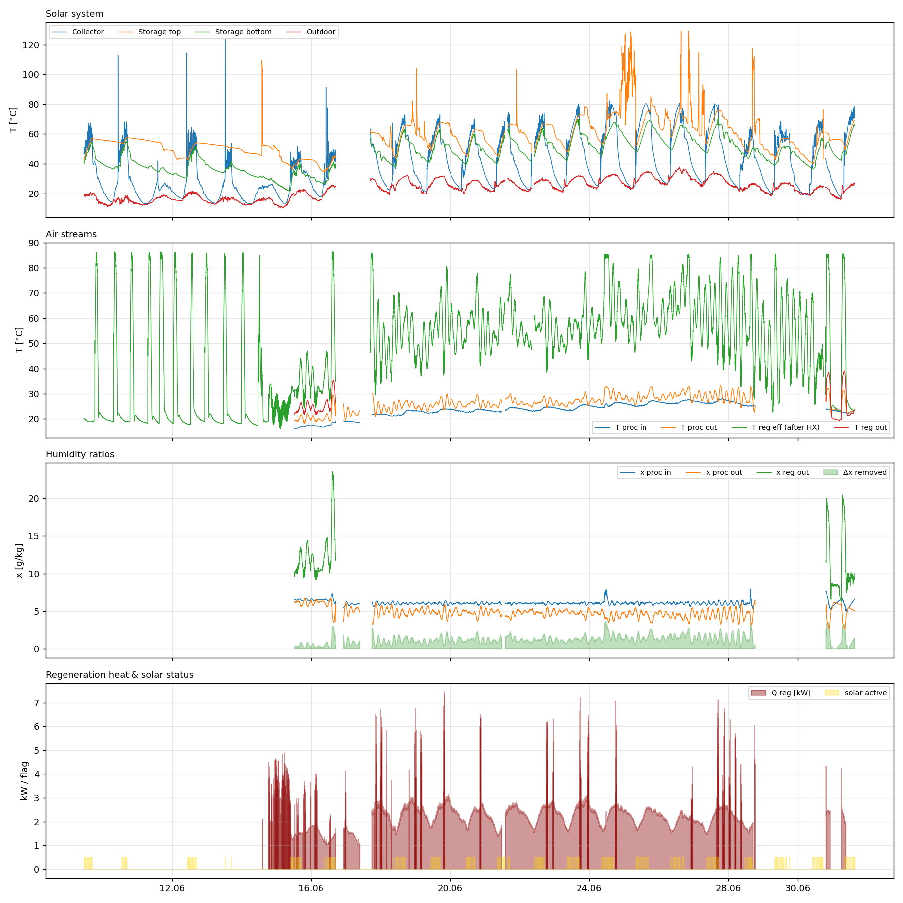
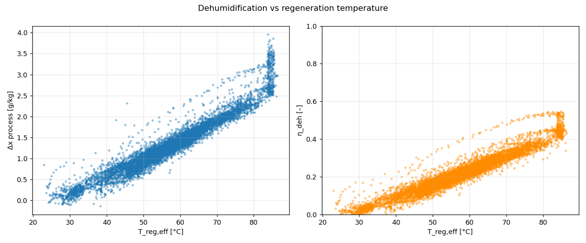
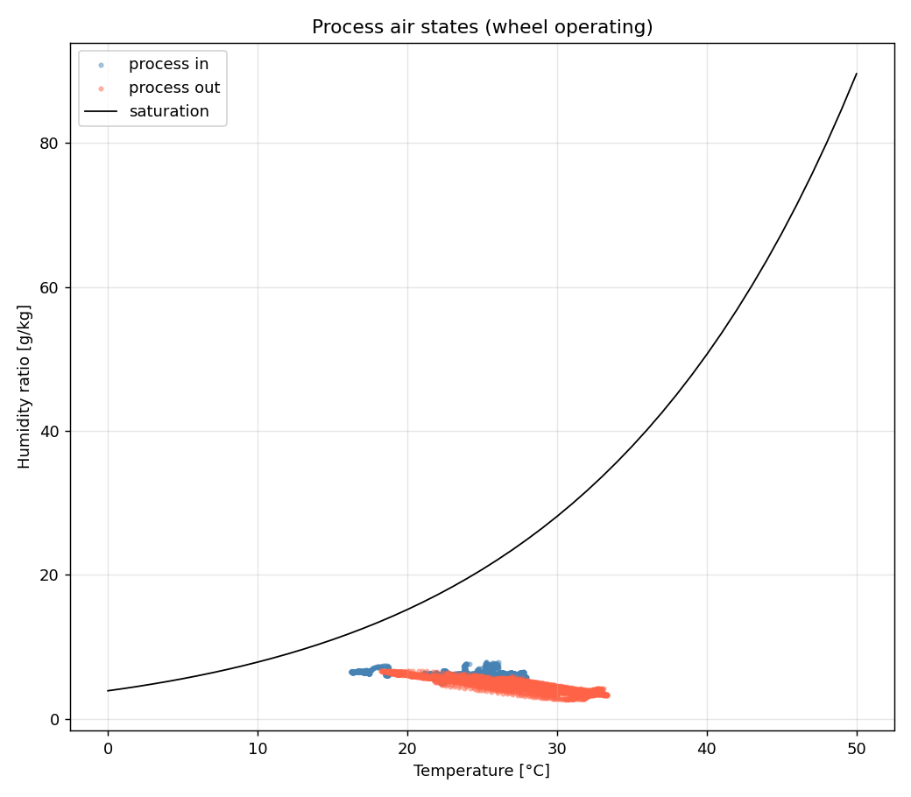
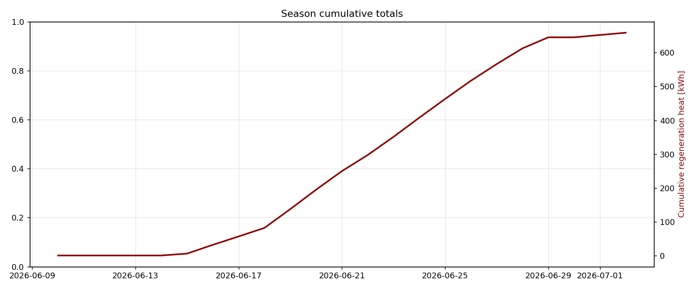

# Solar-assisted desiccant wheel — season summary (2026-06-10 → 2026-07-02)

_Run: 2026-07-18 20:06 UTC · code+data revision `local`. Every pipeline run rewrites this stamp, so a fresh commit here proves the analysis actually ran on your upload._

## Data quality

| Quantity | Value |
|---|---|
| rows | 15960 |
| start | 2026-06-10 11:20:00+02:00 |
| end | 2026-07-02 15:18:00+02:00 |
| artefact_rows_masked | 16411 |
| plausibility_flags | 15668 |
| coverage_T_proc_in | 0.605 |
| coverage_T_reg_nach_HX | 0.946 |
| coverage_V_dot_III | 0.569 |

## Measured-period totals

**Not full-season totals** — integrals cover only instrumented periods (see coverage figures); no extrapolation is applied.

| Quantity | Value |
|---|---|
| Q_reg_kWh | 660.185 |
| Q_reg_coverage | 0.572 |
| Q_reg_net_kWh | 660.182 |
| E_el_kWh | 0.000 |

_Air-flow sources: process = None, regeneration = measured (L/s assumed)._

## Solar contribution

| Quantity | Value |
|---|---|
| solar_fraction | 0.605 |
| Q_aux_kWh | 416.000 |
| Q_solar_kWh | 637.897 |
| solar_fraction_note | electric booster heater included (thermally inferred — not electrically metered); SF over timesteps where both sides known |
| solar_collection_share_while_running | 0.206 |

## Energy-balance closure

| Quantity | Value |
|---|---|
| Q_reg_hydronic_kWh | 660.185 |
| Q_reg_air_kWh_window | 17.794 |
| Q_reg_input_kWh_window | 18.517 |
| closure_window_hours | 3.200 |
| closure | 0.961 |

## Air-to-water HX balance (regeneration coil)

Boundary = regeneration heating coil. Water side (`Q_hx_water` = circuit-III heat given up) vs air side (`Q_hx_air` = regeneration-air sensible gain across the coil). `hx_closure = Q_hx_air / Q_hx_water` — expected ≈ 0.8–1.0; the air side needs the ch 120 regeneration air flow, so the closure covers only the window where both sides are measured.

| Quantity | Value |
|---|---|
| Q_hx_water_kWh | 660.185 |
| Q_hx_air_kWh_window | 8.100 |
| Q_hx_water_kWh_window | 8.821 |
| hx_window_hours | 3.200 |
| hx_closure | 0.918 |

## Thermal-storage balance (energy in vs out + ΔU)

Boundary = stratified store. Charge (`Q_store_in`, circuit II) vs discharge (`Q_store_out`, circuit III = regeneration heat) plus the stored-energy change ΔU from the SP layer temperatures. Absolute ΔU, standby loss and closure require the tank volume (`config.STORAGE_VOLUME_M3`); until then ΔU is reported per m³.

| Quantity | Value |
|---|---|
| Q_store_out_kWh | 660.185 |
| Q_store_out_coverage | 0.572 |
| Q_store_in_kWh | 11.245 |
| Q_store_in_coverage | 0.021 |
| T_store_start_C | 41.200 |
| T_store_end_C | 68.260 |
| dU_store_kWh_per_m3 | 30.991 |
| dU_store_note | set config.STORAGE_VOLUME_M3 for absolute ΔU, standby loss and closure |

## KPIs by regeneration temperature bin

| T_reg_bin   |   hours |   Delta_x_mean_gkg |   eta_deh_mean |   Q_reg_kWh |   Q_reg_coverage |   Q_reg_net_kWh |   E_el_kWh |
|:------------|--------:|-------------------:|---------------:|------------:|-----------------:|----------------:|-----------:|
| (30, 35]    |  21.100 |              0.255 |          0.040 |      23.171 |            0.028 |          23.171 |      0.000 |
| (35, 40]    |  17.100 |              0.474 |          0.077 |       9.392 |            0.011 |           9.392 |      0.000 |
| (40, 45]    |  25.067 |              0.677 |          0.111 |      25.457 |            0.023 |          25.457 |      0.000 |
| (45, 50]    |  42.833 |              0.853 |          0.141 |      71.551 |            0.063 |          71.551 |      0.000 |
| (50, 55]    |  56.867 |              1.065 |          0.177 |     107.783 |            0.093 |         107.783 |      0.000 |
| (55, 60]    |  66.033 |              1.296 |          0.215 |     129.031 |            0.109 |         129.031 |      0.000 |
| (60, 65]    |  46.833 |              1.522 |          0.252 |      87.372 |            0.074 |          87.372 |      0.000 |
| (65, 70]    |  30.033 |              1.780 |          0.294 |      48.373 |            0.041 |          48.373 |      0.000 |

## Daily summary

| period                    |   Q_reg_kWh |   Q_reg_coverage |   Q_reg_net_kWh |   E_el_kWh |   T_proc_in_mean |   Phi_proc_in_mean |   T_reg_eff_mean |   Delta_x_proc_gkg_mean |   T_AU_mean |   T_SP_oben_mean |   runtime_h |   solar_fraction |   Q_aux_kWh |   Q_solar_kWh | solar_fraction_note                                                                                                        |   solar_collection_share_while_running |
|:--------------------------|------------:|-----------------:|----------------:|-----------:|-----------------:|-------------------:|-----------------:|------------------------:|------------:|-----------------:|------------:|-----------------:|------------:|--------------:|:---------------------------------------------------------------------------------------------------------------------------|---------------------------------------:|
| 2026-06-10 00:00:00+02:00 |       0     |            0     |           0     |          0 |          nan     |            nan     |           28.894 |                 nan     |      17.629 |           53.89  |       2.667 |          nan     |     nan     |       nan     | nan                                                                                                                        |                                nan     |
| 2026-06-11 00:00:00+02:00 |       0     |            0     |           0     |          0 |          nan     |            nan     |           30.208 |                 nan     |      14.411 |           55.649 |       5.7   |          nan     |     nan     |       nan     | nan                                                                                                                        |                                nan     |
| 2026-06-12 00:00:00+02:00 |       0     |            0     |           0     |          0 |          nan     |            nan     |           32.3   |                 nan     |      15.311 |           53.643 |       6.633 |          nan     |     nan     |       nan     | nan                                                                                                                        |                                nan     |
| 2026-06-13 00:00:00+02:00 |       0     |            0     |           0     |          0 |          nan     |            nan     |           32.684 |                 nan     |      17.585 |           48.614 |       7.267 |          nan     |     nan     |       nan     | nan                                                                                                                        |                                nan     |
| 2026-06-14 00:00:00+02:00 |       0     |            0     |           0     |          0 |          nan     |            nan     |           26.832 |                 nan     |      15.032 |           51.668 |       4.533 |          nan     |     nan     |       nan     | nan                                                                                                                        |                                nan     |
| 2026-06-15 00:00:00+02:00 |       5.592 |            0.103 |           5.59  |          0 |          nan     |            nan     |           29.087 |                 nan     |      14.449 |           49.733 |      13.733 |            0.878 |       0.774 |         5.592 | electric booster heater included (thermally inferred — not electrically metered); SF over timesteps where both sides known |                                  0     |
| 2026-06-16 00:00:00+02:00 |      25.947 |            0.636 |          25.947 |          0 |           16.966 |             52.668 |           30.074 |                   0.399 |      17.111 |           42.031 |      24     |            0.74  |       9.101 |        25.947 | electric booster heater included (thermally inferred — not electrically metered); SF over timesteps where both sides known |                                  0.103 |
| 2026-06-17 00:00:00+02:00 |      24.827 |            0.709 |          24.827 |          0 |           17.595 |             50.296 |           40.081 |                   0.646 |      19.734 |           39.35  |      17.1   |            0.496 |      23.332 |        22.99  | electric booster heater included (thermally inferred — not electrically metered); SF over timesteps where both sides known |                                  0.146 |
| 2026-06-18 00:00:00+02:00 |      25.255 |            0.588 |          25.255 |          0 |           20.02  |             39.994 |           57.406 |                   0.98  |      27.404 |           60.392 |       7     |            0.568 |       8.903 |        11.717 | electric booster heater included (thermally inferred — not electrically metered); SF over timesteps where both sides known |                                  0     |
| 2026-06-19 00:00:00+02:00 |      55.497 |            0.99  |          55.497 |          0 |           22.043 |             35.606 |           53.07  |                   1.105 |      26.075 |           58.031 |      24     |            0.619 |      34.186 |        55.497 | electric booster heater included (thermally inferred — not electrically metered); SF over timesteps where both sides known |                                  0.247 |
| 2026-06-20 00:00:00+02:00 |      57.5   |            0.968 |          57.5   |          0 |           23.085 |             33.521 |           53.768 |                   1.118 |      26.426 |           60.922 |      24     |            0.638 |      32.625 |        57.5   | electric booster heater included (thermally inferred — not electrically metered); SF over timesteps where both sides known |                                  0.174 |
| 2026-06-21 00:00:00+02:00 |      54.864 |            0.983 |          54.864 |          0 |           23.302 |             33.025 |           57.198 |                   1.258 |      25.205 |           56.326 |      24     |            0.551 |      44.662 |        54.864 | electric booster heater included (thermally inferred — not electrically metered); SF over timesteps where both sides known |                                  0.208 |
| 2026-06-22 00:00:00+02:00 |      47.735 |            0.897 |          47.735 |          0 |           23.634 |             32.398 |           57.255 |                   1.296 |      25.631 |           57.259 |      22.133 |            0.582 |      31.429 |        43.731 | electric booster heater included (thermally inferred — not electrically metered); SF over timesteps where both sides known |                                  0.236 |
| 2026-06-23 00:00:00+02:00 |      53.673 |            0.964 |          53.673 |          0 |           23.892 |             31.893 |           54.915 |                   1.194 |      25.809 |           60.851 |      22.433 |            0.654 |      27.024 |        50.972 | electric booster heater included (thermally inferred — not electrically metered); SF over timesteps where both sides known |                                  0.25  |
| 2026-06-24 00:00:00+02:00 |      56.774 |            0.994 |          56.774 |          0 |           24.325 |             31.096 |           55.39  |                   1.226 |      27.308 |           62.528 |      24     |            0.695 |      24.97  |        56.774 | electric booster heater included (thermally inferred — not electrically metered); SF over timesteps where both sides known |                                  0.296 |
| 2026-06-25 00:00:00+02:00 |      55.363 |            0.994 |          55.363 |          0 |           25.451 |             29.679 |           64.368 |                   1.671 |      28.789 |           69.068 |      24     |            0.594 |      37.801 |        55.363 | electric booster heater included (thermally inferred — not electrically metered); SF over timesteps where both sides known |                                  0.267 |
| 2026-06-26 00:00:00+02:00 |      53.895 |            1     |          53.895 |          0 |           25.936 |             28.293 |           62.085 |                   1.496 |      29.692 |           78.493 |      24     |            0.658 |      28.005 |        53.895 | electric booster heater included (thermally inferred — not electrically metered); SF over timesteps where both sides known |                                  0.349 |
| 2026-06-27 00:00:00+02:00 |      49.318 |            1     |          49.318 |          0 |           26.687 |             27.072 |           65.322 |                   1.623 |      31.677 |           71.409 |      24     |            0.561 |      38.594 |        49.318 | electric booster heater included (thermally inferred — not electrically metered); SF over timesteps where both sides known |                                  0.221 |
| 2026-06-28 00:00:00+02:00 |      46.466 |            0.917 |          46.466 |          0 |           26.85  |             26.77  |           62.352 |                   1.519 |      30.095 |           67.69  |      24     |            0.593 |      31.836 |        46.466 | electric booster heater included (thermally inferred — not electrically metered); SF over timesteps where both sides known |                                  0.318 |
| 2026-06-29 00:00:00+02:00 |      32.682 |            0.68  |          32.682 |          0 |           25.884 |             28.484 |           57.81  |                   1.444 |      24.485 |           60.786 |      24     |            0.547 |      27.064 |        32.682 | electric booster heater included (thermally inferred — not electrically metered); SF over timesteps where both sides known |                                  0.097 |
| 2026-06-30 00:00:00+02:00 |       0     |            0     |           0     |          0 |          nan     |            nan     |           50.743 |                 nan     |      23.738 |           51.226 |      24     |          nan     |     nan     |       nan     | nan                                                                                                                        |                                nan     |
| 2026-07-01 00:00:00+02:00 |       6.891 |            0.118 |           6.891 |          0 |           23.743 |             32.405 |           49.394 |                   1.963 |      21.633 |           50.58  |      21     |            0.489 |       7.203 |         6.891 | electric booster heater included (thermally inferred — not electrically metered); SF over timesteps where both sides known |                                  0.3   |
| 2026-07-02 00:00:00+02:00 |       6.727 |            0.198 |           6.727 |          0 |           22.814 |             33.855 |           34.179 |                   0.827 |      21.321 |           57.601 |       3.433 |            0.448 |       8.273 |         6.727 | electric booster heater included (thermally inferred — not electrically metered); SF over timesteps where both sides known |                                  0.301 |

## Figures

---
_Auto-generated by dw-analysis. KPI definitions and sources: see docs/KPI_DEFINITIONS.md._